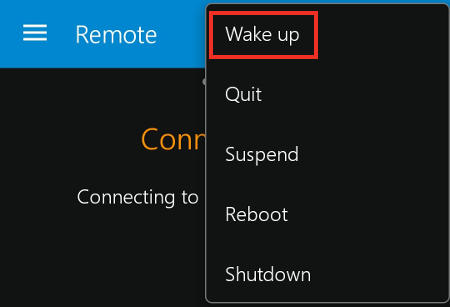

Kakeup
=======

[](https://github.com/Ventto/kakeup/blob/master/LICENSE)
[](https://github.com/Ventto/Kakeup/)
[](https://www.python.org/)

*Kakeup is a Python script to leverage the Kore remote 'Wake Up' button to start Kodi on
running platform.*

Introduction
------------

The purpose is starting the Kodi server on a running platform such as
Raspberry-Pi without any intrusive and fastidious way as opening a ssh-session.

The Kore remote is the official Kodi remote and a wonderful application which
implements a "Wake-On-Lan" button (cf. below) that allows a computer to be turned on or
awakened by a network message.

Kakeup is a tiny workaround for those which are not interested in that feature
and sometimes want to quit and start the Kodi process on a permanent running Rpi.




Requirements
------------

* *python3.5*
* *python-argparse*

Installation
------------

Using a RAW socket listening to a default low number port (cf. screenshot),
you need to:

* Run the script as a privileged user (sudo only)
* Or use a loginless and passwordless user and give it the permissions it needs

*Most modern systems ignore suid/sgid bits on scripts with any interpreter.<br />
So any SUID/CAP set on the script will be ignored.*


Usage
-----

```
usage: kakeup.py [-h] -c CMD -m MACADDR [-i IPSRC] [-p PORT]

optional arguments:
  -h, --help  show this help message and exit
  -c CMD      Shell CMD to execute [required]
  -m MACADDR  Specifies a destination MACADDR [required]
  -i IPSRC    Specifies an IPSRC address
  -p PORT     Specifies a port NUM, (default=9)

```

* Run it with *sudo*:

```
$ python kakeup.py -c "systemctl start kodi" -m "B8:B2:B2:B2:42:42"
```
