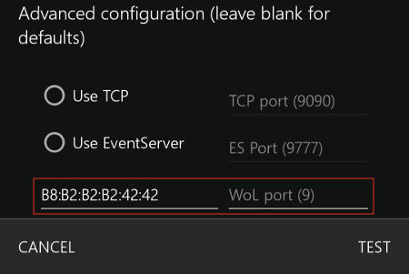

Wakeupkd
==========

[](https://github.com/Ventto/wakeupkd/blob/master/LICENSE)
[](https://github.com/Ventto/wakeupkd/)
[](https://www.python.org/)

*Wakeupkd is a Python program to leverage Kore's "Wake Up" button to start Kodi.*

Introduction
------------

The purpose was to start a Kodi server without any intrusive and fastidious way as
opening a ssh-session.

On the Raspberry-Pi, I did not need 'Wake' or 'Suspend' features
So I have leveraged a Kore button such as "Wake Up". After pressing it, the latter sends
Wake-On-Lan packets even if the Kore remote is not connected to a Kodi server.
So the script simply detects these packets and starts Kodi with a shell
command.


Requirements
------------

* *python3.5*

Installation
------------

Using a RAW socket listening to a default low number port (cf. screenshot),
you need to:

* Run the script as a privileged user (sudo only)
* Or use a loginless and passwordless user and give it the permissions it needs

Most modern systems ignore suid/sgid bits on scripts with any interpreter.<br />
So any SUID/CAP set on the script will be ignored.



Usage
-----

### Archlinux

* It could be nice to run *wakeupkd.py* automatically after boot with root
  privileges.

* Or run it manually:

```
$ sudo python wakeupkd.py
```

### For Others

* Edit `wakeupkd.py` and add your own shell command to start Kodi:

```python
while True:
    packet = sock.recv(WOL_PACKET_MAX_BYTES)
    if __wol_pktcheck(packet):
       print("Kore: <WakeUp>")
       os.system(" { start-kodi } ")
```
